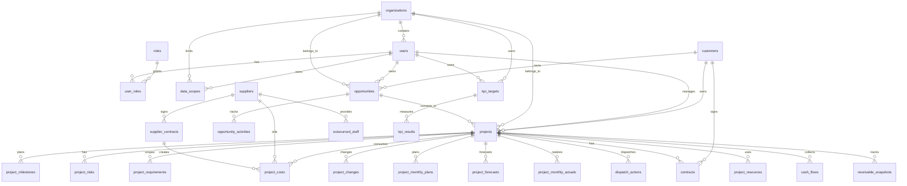

# 经营管理系统核心数据模型

## 1. 设计目标

系统核心不是做很多零散页面，而是先把经营管理的主数据、过程数据和预测数据建清楚。建议围绕 11 个核心域建模：

1. 用户与权限。
2. 组织与数据范围。
3. 客户。
4. 商机。
5. 项目。
6. 合同。
7. 成本与资源。
8. 供应商。
9. 资金与经营事实。
10. 经营预测与调度。
11. KPI 与可视化分析。

项目是交付主线，商机是前端入口，客户、合同、资源、供应商、成本、回款、应收都通过商机和项目关联。经营管理闭环不是独立于业务之外的新流程，而是依托项目经理和售前人员持续维护的商机、项目执行数据形成的管理视图和调度机制。管理闭环是：经营目标/KPI -> 商机储备 -> 项目预测 -> 资源与资金调度 -> 实际完成 -> 偏差分析 -> 管理动作。可视化分析不直接依赖手填汇总数，而是从商机、月度计划、月度预测、月度实际、成本、资金、项目进度等事实表聚合生成。

## 2. 对象分层与数据来源

系统对象分为两层：

| 层级 | 核心对象 | 主要维护人 | 用途 |
| --- | --- | --- | --- |
| 基础执行对象 | 客户、商机、项目、合同、资源、成本、回款、应收、风险 | 售前人员、项目经理、财务/资金人员、经营管理人员 | 记录真实业务执行过程，是所有经营分析和预测的底座 |
| 经营管控对象 | KPI、经营预测、调度动作、经营分析、管理复盘 | 总经理、经营管理人员、业务组总监 | 基于基础数据做目标跟踪、预测判断、资源调度和偏差纠偏 |

基础数据来源：

- 售前人员维护商机执行情况：客户、商机阶段、预计金额、赢单概率、预计签约时间、下一步动作、竞争风险、资源需求。
- 项目经理维护项目执行情况：项目进度、里程碑、资源计划、成本预测、回款预测、风险问题、调度反馈。
- 财务/资金或经营管理人员导入实际数据：确认收入、管理口径收入、成本实际、回款实际、应收余额、账龄。
- 经营管理人员维护口径和目标：指标定义、KPI 目标、数据校验、经营调整说明。

经营管理闭环的输入不是管理人员手工编造的汇总数，而是上述基础执行数据按客户、业务组、项目、商机、月份等维度自动汇总、预测和穿透。

## 3. 核心数据关系

## 4. 大表分层

### 4.1 权限与组织层

| 表 | 作用 |
| --- | --- |
| `users` | 用户账号和人员基础信息 |
| `persons` | 真实人员主数据，账号必须关联人员 |
| `roles` | 角色定义，如总经理、经营管理人员、业务组总监、项目经理、管理员 |
| `permissions` | 功能权限点 |
| `role_permissions` | 角色和权限点关系 |
| `user_roles` | 用户和角色关系 |
| `organizations` | 部门、业务组、产品线等组织树 |
| `data_scopes` | 用户可见的数据范围 |

### 4.2 业务主数据层

| 表 | 作用 |
| --- | --- |
| `customers` | 客户主数据 |
| `opportunities` | 商机主数据 |
| `projects` | 项目主数据 |
| `contracts` | 收入合同 |
| `suppliers` | 供应商主数据 |
| `supplier_contracts` | 采购、外包、供应商合同 |
| `staff` | 自有人员主数据 |
| `outsourced_staff` | 外包人员主数据 |

### 4.3 项目过程层

| 表 | 作用 |
| --- | --- |
| `project_milestones` | 阶段和里程碑 |
| `project_requirements` | 需求和范围 |
| `project_changes` | 范围、金额、工期变更 |
| `project_acceptances` | 验收记录 |
| `project_risks` | 风险和问题 |

### 4.4 经营事实层

| 表 | 作用 |
| --- | --- |
| `project_monthly_plans` | 项目月度计划 |
| `project_monthly_actuals` | 项目月度实际 |
| `project_forecasts` | 项目滚动预测 |
| `project_resources` | 自有和外包资源投入 |
| `project_costs` | 项目成本明细 |
| `cash_flows` | 回款和付款流水 |
| `receivable_snapshots` | 应收余额和账龄快照 |
| `metric_targets` | 指标目标和预算 |
| `metric_snapshots` | 月度指标快照 |

### 4.5 管控动作层

| 表 | 作用 |
| --- | --- |
| `kpi_targets` | KPI 目标分解 |
| `kpi_results` | KPI 完成结果 |
| `dispatch_actions` | 经营调度动作 |
| `management_reviews` | 经营例会、复盘和决议 |
| `opportunity_activities` | 商机跟进记录 |

## 5. 用户、角色与权限模型

### 5.1 `persons`

人员是真实员工或外部协作人的主数据，表示“这个人是谁、属于哪个组织、是什么岗位”。人员不等于登录账号，一个人可以没有账号，也可以在特殊场景下拥有多个账号。

| 字段 | 说明 |
| --- | --- |
| `id` | 人员 ID |
| `employee_no` | 工号 |
| `real_name` | 真实姓名 |
| `photo_url` | 人员照片地址 |
| `id_card` | 身份证号 |
| `person_type` | 人员类型：合同制、第三方、分公司 |
| `supplier_id` | 第三方人员对应供应商，非第三方可为空 |
| `org_id` | 所属组织 |
| `position` | 岗位 |
| `email` | 邮箱 |
| `mobile` | 手机 |
| `status` | 在职、离职、停用 |
| `effective_from` | 生效日期 |
| `effective_to` | 失效日期，空表示长期有效 |

### 5.2 `users`

用户是登录账号，表示“这个账号能登录系统、拥有哪些角色权限、能看哪些数据”。用户必须尽量关联到 `persons`，权限审计和组织归属应优先通过人员主数据追溯。

| 字段 | 说明 |
| --- | --- |
| `id` | 用户 ID |
| `username` | 登录账号 |
| `person_id` | 关联人员 |
| `display_name` | 姓名 |
| `employee_no` | 工号 |
| `email` | 邮箱 |
| `mobile` | 手机 |
| `org_id` | 所属组织 |
| `manager_id` | 上级 |
| `status` | 启用、停用 |
| `effective_from` | 用户授权和组织归属生效日期 |
| `effective_to` | 用户授权和组织归属失效日期，空表示长期有效 |
| `last_login_at` | 最近登录时间 |

### 5.3 `organizations`

| 字段 | 说明 |
| --- | --- |
| `id` | 组织 ID |
| `name` | 组织名称 |
| `type` | 组织类型：事业部、部门、业务组、产品线、虚拟团队 |
| `parent_id` | 上级组织，用于形成组织树和汇总口径 |
| `status` | 启用、停用 |
| `effective_from` | 组织生效日期 |
| `effective_to` | 组织失效日期，空表示长期有效 |

组织必须支持层级关系的图形化展示。业务组总监、经营管理人员和总经理看到的汇总口径，都应基于组织树向上汇总、向下穿透；同时保留生效和失效日期，便于处理组织调整、人员调动和历史经营归属。

### 5.4 `roles`

核心角色：

| 角色 | 说明 |
| --- | --- |
| 总经理 | 查看全部经营数据、KPI、商机、项目、资金和预警；关注目标达成、经营预测、资源调度和重大风险 |
| 经营管理人员 | 查看全部数据；管理指标口径、KPI目标、经营预测、数据导入、调度跟踪和经营分析 |
| 业务组总监 | 查看所辖业务组经营指标，并管理本组产品线、客户、商机和项目；审核项目预测，调度资源，跟踪 KPI |
| 项目经理 | 维护自己项目的进度、计划、资源、成本预测、回款预测、风险问题；反馈调度动作执行结果 |
| 售前人员 | 维护本人负责的商机、客户跟进、预计签约、预计收入毛利和下一步动作 |

辅助角色：

| 角色 | 说明 |
| --- | --- |
| 财务/资金人员 | 维护或导入回款、应收、付款、成本实际 |
| 供应商管理员 | 维护供应商、外包资源、采购和结算信息 |
| 系统管理员 | 用户、角色、组织、权限、字典配置 |

### 5.5 层级管控规则

| 角色 | 默认数据范围 | 主要管理动作 |
| --- | --- | --- |
| 总经理 | 全部客户、商机、项目、合同、成本、资金、KPI | 查看全局、下达目标、关注预警、发起重大调度 |
| 经营管理人员 | 全部数据 | 维护口径、分解 KPI、汇总预测、组织经营分析、跟踪调度闭环 |
| 业务组总监 | 所辖业务组/产品线/客户/项目及其汇总经营指标 | 查看本组收入、毛利、毛利率、签约、商机、回款、应收、项目健康度；审核预测、调度资源、推进商机、处理风险、承接 KPI |
| 项目经理 | 本人负责或参与的项目 | 维护项目计划、进度、资源、风险、回款预测和交付反馈 |
| 售前人员 | 本人负责或参与的商机 | 维护商机阶段、金额、概率、预计签约、跟进动作和风险 |

层层管控建议：

- KPI 自上而下分解：总经理/经营管理 -> 业务组总监 -> 项目经理/项目。
- 预测自下而上汇总：售前人员填商机预测、项目经理填项目预测 -> 业务组总监审核 -> 经营管理汇总 -> 总经理查看。
- 调度自上而下闭环：总经理/经营管理/业务组总监发起调度动作 -> 指定责任人 -> 跟踪状态 -> 关闭复盘。
- 数据穿透自上而下：总经理和经营管理可从全局指标穿透到业务组、客户、项目、合同、成本和资金；业务组总监可查看本组汇总经营指标并穿透所辖客户、商机、项目、合同、成本和资金；项目经理只能看自己的项目明细。

### 5.6 `permissions`

权限建议拆成两类：

功能权限：

- 项目查看、项目编辑、项目删除。
- 项目进度维护。
- 项目预算维护。
- 月度计划填报。
- 经营预测填报。
- 经营预测审核。
- KPI目标维护。
- KPI完成查看。
- 调度动作发起。
- 调度动作反馈。
- 商机查看、商机维护、商机推进。
- 经营实际导入。
- 成本查看、成本维护。
- 资金查看、资金维护。
- 客户查看、客户维护。
- 供应商查看、供应商维护。
- 指标看板查看。
- 全局经营分析查看。
- 用户权限管理。

数据权限：

- 仅本人项目。
- 本人商机。
- 本业务组项目。
- 本业务组商机。
- 本部门项目。
- 指定产品线项目。
- 指定客户项目。
- 全部项目。
- 全部商机。
- 全部经营数据。

### 5.7 `data_scopes`

| 字段 | 说明 |
| --- | --- |
| `user_id` | 用户 |
| `scope_type` | 数据范围类型：本人、组织、业务组、产品线、客户、项目、全部 |
| `scope_id` | 对应范围 ID |
| `permission_level` | 只读、编辑、审批、管理 |
| `effective_from` | 生效日期 |
| `effective_to` | 失效日期 |

权限判断建议：

1. 先判断功能权限，决定能不能进入页面或执行动作。
2. 再判断数据权限，决定能看到哪些客户、项目、合同、成本、资金记录。
3. 对成本单价、人员成本、毛利等敏感字段增加字段级权限。

## 6. 客户域

### 6.1 `customers`

| 字段 | 说明 |
| --- | --- |
| `id` | 客户 ID |
| `customer_code` | 客户编号 |
| `customer_name` | 客户名称 |
| `short_name` | 客户简称 |
| `credit_code` | 统一社会信用代码 |
| `customer_type` | 外部客户、内部单位、集团客户、合作伙伴 |
| `industry_l1` | 一级行业 |
| `industry_l2` | 二级行业 |
| `province` | 省份 |
| `region` | 区域 |
| `customer_level` | 战略、重点、普通 |
| `account_manager_id` | 客户经理 |
| `owning_org_id` | 归属组织 |
| `cooperation_status` | 潜在、合作中、暂停、终止 |
| `risk_level` | 低、中、高 |

客户分析指标：

- 客户累计签约金额。
- 客户累计收入。
- 客户累计毛利。
- 客户累计回款。
- 客户应收余额。
- 客户逾期应收。
- 客户项目数量。
- 客户项目健康度分布。
- 客户收入/毛利集中度。

## 7. 商机域

商机是经营预测的前端入口。商机管理不只是销售线索，而是要回答“未来收入在哪里、签约概率多大、预计转化到哪些项目、需要哪些资源、对 KPI 有多少贡献”。

### 7.1 `opportunities`

| 字段 | 说明 |
| --- | --- |
| `id` | 商机 ID |
| `opportunity_code` | 商机编号 |
| `opportunity_name` | 商机名称 |
| `customer_id` | 客户 |
| `owning_org_id` | 归属组织/业务组 |
| `owner_id` | 商机负责人 |
| `sales_manager_id` | 销售经理 |
| `expected_project_manager_id` | 预计项目经理 |
| `product_line` | 产品线 |
| `opportunity_type` | 新签、续约、扩容、运维、咨询、集成 |
| `stage` | 线索、方案、投标、商务、已中标、已签约、已丢失、暂停 |
| `probability` | 赢单概率 |
| `expected_contract_amount` | 预计合同金额 |
| `expected_revenue` | 预计管理口径收入 |
| `expected_gross_profit` | 预计毛利 |
| `expected_sign_date` | 预计签约日期 |
| `expected_start_date` | 预计项目启动日期 |
| `expected_cash_in` | 预计回款 |
| `resource_demand` | 预计资源需求 |
| `competitor` | 竞争对手 |
| `next_action` | 下一步动作 |
| `next_action_due_date` | 下一步截止日期 |
| `risk_level` | 商机风险 |
| `loss_reason` | 丢单原因 |
| `converted_project_id` | 转化后的项目 |

商机预测指标：

- 商机储备金额。
- 加权商机金额 = 预计合同金额 * 赢单概率。
- 预计签约金额。
- 预计收入贡献。
- 预计毛利贡献。
- 商机转化率。
- 商机阶段分布。
- 重点商机推进状态。

### 7.2 `opportunity_activities`

| 字段 | 说明 |
| --- | --- |
| `opportunity_id` | 商机 |
| `activity_type` | 拜访、方案、报价、投标、澄清、商务谈判、内部评审 |
| `activity_date` | 活动日期 |
| `owner_id` | 负责人 |
| `content` | 跟进内容 |
| `outcome` | 结果 |
| `next_action` | 下一步 |
| `next_action_due_date` | 下一步截止日期 |
| `status` | 打开、完成、延期、取消 |

商机转项目规则：

- 已签约商机可以转为项目。
- 转项目时带出客户、产品线、预计金额、预计毛利、预计启动时间、商机负责人。
- 商机到项目后仍保留来源关系，用于分析商机转化、签约达成和预测准确率。

## 8. 项目域

### 8.1 `projects`

| 字段 | 说明 |
| --- | --- |
| `id` | 项目 ID |
| `project_code` | 项目编号 |
| `project_name` | 项目名称 |
| `customer_id` | 客户 |
| `project_type` | 自研研发、客户交付、系统集成、运维、咨询、外包服务 |
| `delivery_mode` | 自主实施、联合交付、第三方转包、省分派单 |
| `internal_external` | 内部、外部 |
| `product_line` | 产品线 |
| `org_id` | 所属部门 |
| `business_group_id` | 业务组 |
| `project_manager_id` | 项目经理 |
| `sales_manager_id` | 销售经理 |
| `tech_lead_id` | 技术负责人 |
| `approval_date` | 立项日期 |
| `planned_start_date` | 计划开始日期 |
| `planned_end_date` | 计划结束日期 |
| `actual_start_date` | 实际开始日期 |
| `actual_end_date` | 实际结束日期 |
| `project_status` | 商机中、待立项、已立项、交付中、验收中、运维中、已关闭、暂停、终止 |
| `current_phase` | 售前、计划、需求、设计、开发、测试、上线、验收、运维 |
| `progress_percent` | 项目进度 |
| `health_status` | 绿、黄、红 |
| `is_key_project` | 是否重点项目 |
| `stock_increment` | 存量、增量 |

项目主表只存当前状态和核心归属，累计收入、累计成本、累计毛利、累计回款、应收余额应从事实表汇总生成。

### 8.2 `project_milestones`

| 字段 | 说明 |
| --- | --- |
| `project_id` | 项目 |
| `phase_name` | 阶段 |
| `milestone_name` | 里程碑 |
| `deliverable` | 交付物 |
| `owner_id` | 责任人 |
| `planned_start_date` | 计划开始 |
| `planned_finish_date` | 计划完成 |
| `actual_start_date` | 实际开始 |
| `actual_finish_date` | 实际完成 |
| `completion_percent` | 完成比例 |
| `status` | 未开始、进行中、已完成、延期、暂停、取消 |
| `delay_reason` | 延期原因 |

### 8.3 `project_risks`

| 字段 | 说明 |
| --- | --- |
| `project_id` | 项目 |
| `risk_type` | 风险、问题 |
| `category` | 进度、范围、成本、质量、资源、客户、供应商、回款、合同 |
| `title` | 标题 |
| `description` | 描述 |
| `impact` | 影响程度 |
| `probability` | 发生概率 |
| `risk_level` | 风险等级 |
| `owner_id` | 责任人 |
| `action_plan` | 应对措施 |
| `due_date` | 计划关闭日期 |
| `closed_at` | 实际关闭日期 |
| `status` | 打开、处理中、已关闭、挂起 |

## 9. 合同域

### 9.1 `contracts`

| 字段 | 说明 |
| --- | --- |
| `id` | 合同 ID |
| `contract_code` | 合同编号 |
| `contract_name` | 合同名称 |
| `customer_id` | 客户 |
| `project_id` | 项目 |
| `contract_type` | 收入合同、补充协议、框架协议 |
| `signed_date` | 签订日期 |
| `tax_rate` | 税率 |
| `amount_with_tax` | 含税金额 |
| `amount_without_tax` | 不含税金额 |
| `contract_status` | 拟签、已签、履行中、已完成、终止 |
| `billing_terms` | 计收/开票条件 |
| `payment_terms` | 回款条件 |

合同是客户、项目、收入、回款、应收之间的桥。多税率、多条款合同建议拆成合同条款明细表。

## 10. 成本与资源域

### 10.1 `project_resources`

| 字段 | 说明 |
| --- | --- |
| `project_id` | 项目 |
| `month` | 月份 |
| `resource_type` | 自有人员、外包人员、供应商团队 |
| `staff_id` | 自有人员 |
| `outsourced_staff_id` | 外包人员 |
| `supplier_id` | 供应商 |
| `role_name` | 项目经理、产品、架构、开发、测试、实施、运维 |
| `allocation_ratio` | 投入比例 |
| `person_month` | 投入人月 |
| `unit_cost` | 成本单价 |
| `planned_cost` | 计划成本 |
| `actual_cost` | 实际成本 |
| `status` | 计划、已确认、已投入、已释放 |

### 10.2 `project_costs`

| 字段 | 说明 |
| --- | --- |
| `project_id` | 项目 |
| `month` | 月份 |
| `cost_type` | 自有人员、外包人员、供应商服务、设备、软件、云资源、差旅、分公司成本、其他 |
| `supplier_id` | 供应商，外包或采购成本必填 |
| `resource_id` | 资源投入记录 |
| `contract_id` | 关联采购/外包合同 |
| `amount_with_tax` | 含税金额 |
| `amount_without_tax` | 不含税金额 |
| `tax_rate` | 税率 |
| `cost_status` | 预算、已发生、已结算、已锁定 |
| `source` | 手工、Excel、财务系统 |

成本汇总口径：

- 自有人员成本 = 自有人员投入人月 * 内部成本单价。
- 外包人员成本 = 外包投入人月 * 外包采购单价，并关联供应商。
- 其他成本 = 差旅、设备、云资源、软件采购、分公司成本、第三方服务等。

## 11. 供应商域

### 11.1 `suppliers`

| 字段 | 说明 |
| --- | --- |
| `id` | 供应商 ID |
| `supplier_code` | 供应商编号 |
| `supplier_name` | 供应商名称 |
| `credit_code` | 统一社会信用代码 |
| `supplier_type` | 外包人力、软件服务、设备、云资源、咨询、其他 |
| `contact_name` | 联系人 |
| `contact_phone` | 联系方式 |
| `cooperation_status` | 合作中、暂停、黑名单、终止 |
| `rating` | 评级 |
| `risk_level` | 风险等级 |

供应商分析指标：

- 供应商累计采购金额。
- 供应商外包人员数量。
- 供应商项目数量。
- 未结算金额。
- 延期或质量问题次数。
- 供应商成本占比。

## 12. 资金与经营事实域

### 12.1 `project_monthly_plans`

| 字段 | 说明 |
| --- | --- |
| `project_id` | 项目 |
| `year` | 年份 |
| `month` | 月份 |
| `planned_revenue` | 计划确认收入 |
| `planned_management_revenue` | 计划管理口径收入 |
| `planned_cost` | 计划成本 |
| `planned_gross_profit` | 计划毛利 |
| `planned_cash_in` | 计划回款 |
| `planned_receivable_age` | 预计账龄 |
| `submitter_id` | 填报人 |
| `approval_status` | 草稿、已提交、已审核 |

### 12.2 `project_monthly_actuals`

| 字段 | 说明 |
| --- | --- |
| `project_id` | 项目 |
| `customer_id` | 客户 |
| `contract_id` | 合同 |
| `year` | 年份 |
| `month` | 月份 |
| `recognized_revenue` | 确认收入 |
| `management_revenue` | 管理口径收入 |
| `main_revenue` | 主营收入 |
| `cost_amount` | 成本金额 |
| `allocated_gross_profit` | 分摊后毛利 |
| `double_count_revenue` | 双计收入 |
| `cash_in_amount` | 回款金额 |
| `source_batch_id` | 导入批次 |
| `is_locked` | 是否锁定 |

### 12.3 `cash_flows`

| 字段 | 说明 |
| --- | --- |
| `project_id` | 项目 |
| `customer_id` | 客户 |
| `contract_id` | 合同 |
| `flow_type` | 收款、付款 |
| `planned_actual` | 计划、实际 |
| `amount` | 金额 |
| `flow_date` | 日期 |
| `month` | 归属月份 |
| `counterparty_type` | 客户、供应商 |
| `counterparty_id` | 往来方 |
| `status` | 计划、已发生、已核销、异常 |

### 12.4 `receivable_snapshots`

| 字段 | 说明 |
| --- | --- |
| `project_id` | 项目 |
| `customer_id` | 客户 |
| `contract_id` | 合同 |
| `snapshot_month` | 快照月份 |
| `receivable_balance` | 应收余额 |
| `age_0_3m` | 0-3 个月 |
| `age_3_6m` | 3-6 个月 |
| `age_6_12m` | 6-12 个月 |
| `age_over_12m` | 12 个月以上 |
| `stock_receivable_balance` | 存量应收余额 |
| `stock_receivable_collected` | 存量应收已回款 |

## 13. 经营预测、调度与 KPI

### 13.1 `project_forecasts`

项目预测用于滚动判断未来收入、毛利、回款和资源缺口，是经营管理人员和业务组总监最重要的过程数据之一。

| 字段 | 说明 |
| --- | --- |
| `project_id` | 项目 |
| `forecast_month` | 预测月份 |
| `forecast_version` | 预测版本，如月初版、月中调整版、月末复盘版 |
| `forecast_revenue` | 预测确认收入 |
| `forecast_management_revenue` | 预测管理口径收入 |
| `forecast_cost` | 预测成本 |
| `forecast_gross_profit` | 预测毛利 |
| `forecast_cash_in` | 预测回款 |
| `forecast_receivable_balance` | 预测应收余额 |
| `resource_gap` | 资源缺口 |
| `key_assumption` | 预测假设 |
| `risk_note` | 预测风险说明 |
| `submitted_by` | 提交人 |
| `reviewed_by` | 审核人 |
| `review_status` | 草稿、已提交、业务组审核、经营审核、退回 |

预测管理规则：

- 项目经理填报项目级预测。
- 业务组总监审核所辖项目预测，并可提出调度要求。
- 经营管理人员汇总全局预测，形成总经理视图。
- 总经理关注预测与 KPI 差距、重大项目风险和需要跨组协调的问题。

### 13.2 `kpi_targets`

KPI 目标用于自上而下分解经营责任。

| 字段 | 说明 |
| --- | --- |
| `id` | KPI 目标 ID |
| `target_year` | 年份 |
| `target_month` | 月份，可为空表示年度目标 |
| `owner_type` | 责任主体：公司、部门、业务组、项目经理、项目 |
| `owner_id` | 责任主体 ID |
| `metric_code` | 指标编码 |
| `metric_name` | 指标名称 |
| `target_value` | 目标值 |
| `unit` | 单位 |
| `baseline_value` | 基准值 |
| `weight` | 权重 |
| `parent_target_id` | 上级目标 |
| `created_by` | 创建人 |
| `approved_by` | 审批人 |
| `status` | 草稿、已下达、调整中、已关闭 |

建议 KPI：

- 管理口径收入。
- 主营收入。
- 分摊后毛利。
- 分摊后毛利率。
- 合同签约金额。
- 商机储备金额。
- 商机转化率。
- 回款金额。
- 应收余额。
- 存量应收压降率。
- 项目按期率。
- 红黄项目压降数。

### 13.3 `kpi_results`

| 字段 | 说明 |
| --- | --- |
| `target_id` | KPI 目标 |
| `period` | 统计周期 |
| `actual_value` | 实际完成 |
| `forecast_value` | 预测完成 |
| `completion_rate` | 完成率 |
| `gap_value` | 差距 |
| `gap_reason` | 差距原因 |
| `corrective_action` | 纠偏动作 |
| `status` | 正常、预警、严重偏差 |

### 13.4 `dispatch_actions`

调度动作是层层管控的抓手，用于把经营分析变成可追踪的管理动作。

| 字段 | 说明 |
| --- | --- |
| `id` | 调度动作 ID |
| `source_type` | 来源：KPI偏差、项目风险、商机推进、回款风险、资源缺口、经营例会 |
| `source_id` | 来源对象 ID |
| `action_title` | 调度事项 |
| `action_type` | 资源调度、商机推进、回款催收、成本压降、进度纠偏、客户协调、供应商协调 |
| `priority` | 高、中、低 |
| `created_by` | 发起人 |
| `owner_id` | 责任人 |
| `support_org_id` | 协同组织 |
| `due_date` | 要求完成日期 |
| `progress_note` | 进展反馈 |
| `result_note` | 处理结果 |
| `status` | 待处理、处理中、延期、已完成、关闭 |
| `closed_by` | 关闭人 |
| `closed_at` | 关闭时间 |

### 13.5 `management_reviews`

| 字段 | 说明 |
| --- | --- |
| `id` | 经营会议/复盘 ID |
| `review_type` | 周例会、月度经营分析、专项调度、项目复盘 |
| `review_date` | 日期 |
| `scope_type` | 全局、业务组、项目、客户 |
| `scope_id` | 范围 ID |
| `summary` | 会议结论 |
| `key_risks` | 关键风险 |
| `decisions` | 决议 |
| `created_by` | 记录人 |

经营管理闭环：

1. KPI 目标下达。
2. 商机和项目形成预测。
3. 系统计算预测完成率和差距。
4. 经营管理人员或业务组总监发起调度动作。
5. 项目经理或责任人反馈执行。
6. 月度实际导入后复盘预测准确率和 KPI 完成率。

## 14. 可视化分析模型

### 14.1 首页驾驶舱

指标：

- 管理口径收入。
- 主营收入。
- 分摊后毛利。
- 分摊后毛利率。
- 合同签约金额。
- 商机储备金额。
- 加权商机金额。
- 预测收入。
- 预测毛利。
- KPI 预测完成率。
- 立项金额。
- 回款金额。
- 应收余额。
- 收现率。
- 应收占收比。
- 存量应收压降率。
- 红黄项目数。
- 延期里程碑数。
- 低毛利项目数。

维度：

- 年、季度、月。
- 部门、业务组、产品线。
- 客户、行业、区域。
- 总经理、经营管理人员、业务组总监、项目经理。
- 内部/外部。
- 项目类型、交付模式。

### 14.2 总经理视图

- 全局 KPI 完成率和预测完成率。
- 年度/月度收入、毛利、签约、回款、应收。
- 商机储备、加权商机、重点商机转化。
- 业务组排名和差距。
- 红黄项目、重大回款风险、资源缺口。
- 待决策调度事项。

### 14.3 经营管理视图

- 指标口径、目标、实际、预测、差距。
- 月度滚动预测汇总。
- 商机漏斗和预计签约。
- 业务组 KPI 追踪。
- 数据导入校验和经营口径调整。
- 调度动作闭环跟踪。

### 14.4 业务组总监视图

- 本组经营指标：收入、毛利、毛利率、签约、商机储备、加权商机、回款、应收、KPI 完成率。
- 所辖业务组 KPI 完成和预测。
- 所辖商机储备、重点商机、预计签约。
- 所辖项目收入、成本、毛利、回款、应收。
- 本组目标 vs 预测 vs 实际偏差。
- 资源投入和资源缺口。
- 需要协调的客户、供应商、项目风险。
- 项目经理填报和预测审核状态。

### 14.5 项目经理视图

- 我的项目计划、预测、实际和偏差。
- 本月应完成里程碑。
- 项目资源、成本、回款预测。
- 风险问题和调度事项。
- 需要业务组总监/经营管理协调的问题。

### 14.6 项目分析

- 项目列表：收入、成本、毛利、回款、应收、进度、健康度。
- 项目详情：基础信息、里程碑、资源、成本、合同、回款、应收、风险。
- 项目预警：延期、超预算、低毛利、回款逾期、验收阻塞、资源不足。

### 14.7 商机分析

- 商机漏斗：阶段、金额、概率、预计签约月份。
- 商机转化：商机 -> 合同 -> 项目 -> 收入。
- 重点商机跟进：下一步动作、责任人、截止日期。
- 商机预测：预计签约、预计收入、预计毛利、资源需求。
- 丢单分析：原因、客户、行业、产品线。

### 14.8 客户分析

- 客户贡献：签约、收入、毛利、回款、应收。
- 客户集中度：Top 客户收入占比、毛利占比、应收占比。
- 客户风险：逾期应收、验收争议、红黄项目。
- 客户穿透：客户 -> 项目 -> 合同 -> 回款/应收/成本。

### 14.9 成本分析

- 成本结构：自有人员、外包人员、供应商服务、设备、云资源、差旅、其他。
- 成本趋势：按月成本变化。
- 成本超支：计划成本 vs 实际成本。
- 毛利穿透：收入 -> 成本 -> 毛利 -> 低毛利原因。

### 14.10 供应商分析

- 供应商成本排行。
- 外包人员投入。
- 供应商项目分布。
- 未结算金额。
- 供应商风险和质量问题。

### 14.11 资金分析

- 回款计划 vs 实际。
- 应收余额趋势。
- 账龄结构。
- 存量应收压降。
- 客户/项目回款风险。

## 15. 第一阶段建议落地的核心表

如果第一期要快，建议先落 26 张核心表：

1. `users`
2. `roles`
3. `permissions`
4. `role_permissions`
5. `user_roles`
6. `organizations`
7. `data_scopes`
8. `customers`
9. `opportunities`
10. `opportunity_activities`
11. `projects`
12. `contracts`
13. `suppliers`
14. `project_milestones`
15. `project_risks`
16. `project_resources`
17. `project_costs`
18. `project_monthly_plans`
19. `project_forecasts`
20. `project_monthly_actuals`
21. `cash_flows`
22. `receivable_snapshots`
23. `kpi_targets`
24. `kpi_results`
25. `dispatch_actions`
26. `management_reviews`

其中 1-7 支撑用户、权限和组织范围，8-13 是客户/商机/项目/合同/供应商主数据，14-17 管项目过程和成本资源，18-22 支撑计划、预测、实际、资金和应收，23-26 支撑 KPI、经营调度和管理闭环。

## 16. 关键设计原则

- 项目主表不放大量月度经营字段，月度数据进入事实表。
- 客户、项目、合同、供应商都要有独立主数据，避免只作为文本字段。
- 自有人员成本、外包人员成本和其他成本必须分开，外包成本必须关联供应商。
- 经营实际数由导入或接口生成，项目经理主要维护计划、进度、资源预测、风险说明。
- 商机必须进入模型，作为签约、收入、毛利和资源预测的前端依据。
- KPI 必须能按总经理、经营管理、业务组总监、项目经理层层分解和追踪。
- 经营预测必须有版本、有审核、有偏差复盘。
- 调度动作必须有发起人、责任人、截止日期、状态和关闭结果。
- 看板指标必须能穿透到客户、项目、合同、单据、成本、回款和应收。
- 权限必须同时支持角色权限、组织数据权限和敏感字段权限。
