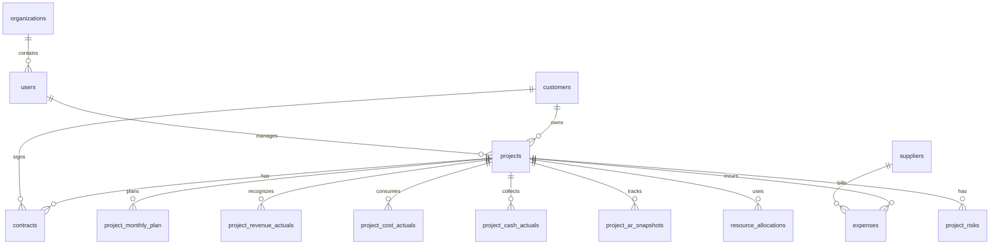

# 经营管理系统建设方案

## 1. 目标定位

建设一套以“项目和商机执行数据”为基础的经营管理系统，把项目立项、商机推进、客户、合同、进度、资源、费用、供应商、回款、收入成本和经营指标统一起来，形成：

- 售前人员可维护的商机执行台账。
- 项目经理可维护的项目经营台账。
- 业务组总监可管理所辖商机、项目、资源、预测和 KPI。
- 经营管理人员可汇总、校验、分析、穿透，并组织经营预测和调度闭环。
- 总经理可查看全局经营驾驶舱、KPI、商机、预测和重大风险。
- 从指标到项目、合同、回款、资源和成本明细的穿透链路。

第一期不建议直接做成完整 ERP，而是先做“商机台账 + 项目台账 + 月度经营事实 + 经营预测 + KPI 看板 + Excel 导入校验”的 MVP。经营管理闭环依托基础执行数据形成：售前人员维护商机执行情况，项目经理维护项目执行情况，财务/经营导入实际经营数据，系统再汇总成预测、KPI、调度和可视化分析。

## 2. 现有资料观察

### 2.1 `1-6月实际完成情况.xlsx`

已有较完整的经营事实数据：

- 工作表：总体情况、OPEX、CAPEX、项目收支明细（不含维护）。
- 项目收支明细 128 条、65 个字段，包含项目编号、项目名称、客户、合同、计收、收入、成本、回款、项目经理、销售经理、产品线、内外部、业务组、月份等。
- 可直接支撑主营收入、管理口径收入、成本、分摊后毛利、内部/外部收入、按项目/项目经理/业务组/月度穿透。
- 当前 1-6 月样本中，管理口径收入约 10,002 万元，其中外部约 6,430 万元、内部约 3,572 万元；供应链产品组是主要收入来源。

### 2.2 `项目管理底表.xlsx`

更像未来的项目主数据与计划预算模板：

- 样本较少，但字段很宽，共 122 个字段。
- 已覆盖项目编号、项目名称、产品线、立项年度、税率、项目经理、业务组、内外部、交付方式、项目类型、客户省份、合同额、成本、回款、应收、累计计收、年度计划、1-12 月收入/支出/毛利/双计收入/账龄等。
- 目前月度字段横向展开，适合 Excel，但不适合系统数据库；系统中应拆成“项目主表 + 项目年度计划 + 项目月度计划/实际”。
- 底表需要先按软件研发和交付项目管理方法重构，详见 `docs/project-management-base-table-optimization.md`。核心方向是从“一张经营宽表”改为“项目主表 + 里程碑 + 资源 + 月度计划 + 月度实际 + 风险问题”等多张窄表。

### 2.3 `2026年4月经营分析--企数0508.pptx`

PPT 指标体系建议纳入系统驾驶舱：

- 主营收入（管理口径）。
- 分摊后毛利。
- 合同签约。
- 项目立项。
- 应收账款、账龄、回款、收现率、应收占收比、存量应收压降。
- 下月收入和毛利预测。
- 市场拓展、重点商机转化。
- 产品研发进展。

## 3. 系统用户与权限

| 角色 | 核心诉求 | 数据范围 | 可维护内容 |
| --- | --- | --- | --- |
| 总经理 | 看全局经营目标达成、预测、KPI、重大风险和调度事项 | 全部数据 | 下达目标、查看全局、发起重大调度、关注经营预警 |
| 经营管理人员 | 管指标口径、经营预测、KPI、数据质量、分析和调度闭环 | 全部数据 | 指标口径、KPI目标、数据导入、预测汇总、调度跟踪、报表发布 |
| 业务组总监 | 管所辖业务组的经营指标、商机、项目、资源、预测和 KPI | 所辖业务组/产品线/客户/项目及其汇总经营指标 | 查看本组收入、毛利、签约、商机、回款、应收等经营指标；审核项目预测、推进商机、调度资源、处理风险、跟踪 KPI |
| 售前人员 | 管本人负责的商机推进和售前预测 | 自己负责/参与的商机 | 商机阶段、预计金额、赢单概率、预计签约、下一步动作、商机风险 |
| 项目经理 | 管项目进度、资源、成本预测、回款预测、风险和执行反馈 | 自己负责/参与的项目 | 项目进度、里程碑、资源计划、成本预测、回款预测、风险说明、调度反馈 |
| 系统管理员 | 管组织、用户、权限、基础字典 | 全部数据 | 用户、角色、组织、数据权限、字典 |

权限原则：

- 系统必须先登录后使用；登录账号是 `users`，真实人员是 `persons`，账号通过 `person_id` 关联人员，角色和权限挂在账号上，组织、岗位和人员生命周期挂在人员上。
- 默认按组织、项目负责人、业务组、产品线做行级权限。
- 组织、用户、角色授权都必须有状态、生效日期和失效日期；历史经营数据按当时有效的组织/人员归属留痕。
- 组织必须维护父子层级并支持图形化展示，经营指标可按组织树汇总和穿透。
- 组织管理页面采用“左侧组织树定位 + 右侧组织台账维护 + 局部组织关系辅助”的工作台布局；全景组织架构图作为弹层或独立视图，用于查看、汇报和导出，不作为日常维护主界面。
- 指标看板可汇总展示，但穿透明细必须按权限过滤。
- 总经理和经营管理人员拥有全局查看、跨部门汇总和口径管理权限。
- 业务组总监拥有所辖范围内的经营指标、商机、项目、预测、资源和 KPI 管理权限，可看本组汇总并穿透到本组客户、商机、项目、合同、成本、回款和应收。
- 售前人员只能维护本人负责或参与的商机执行数据。
- 项目经理只能维护自己项目的业务侧字段，财务实际数建议由导入或接口生成，避免手工改数。
- 系统应支持自上而下的 KPI 分解和调度动作，以及自下而上的商机预测、项目预测填报和业务组审核。

## 4. 一期 MVP 功能范围

### 4.1 商机管理

商机是经营预测和项目来源的前端入口，重点回答“未来收入和毛利在哪里、转化概率多大、何时签约、需要什么资源”。

核心功能：

- 商机台账：商机编号、客户、产品线、业务组、负责人、预计合同额、预计收入、预计毛利、预计签约时间。
- 商机阶段：线索、方案、投标、商务、已中标、已签约、已丢失、暂停。
- 商机预测：赢单概率、加权金额、预计收入贡献、预计毛利贡献、预计资源需求。
- 商机跟进：下一步动作、责任人、截止日期、跟进记录、风险说明。
- 商机转项目：已签约商机转为项目，保留来源关系，用于分析商机转化率和预测准确率。

### 4.2 项目中心

项目是系统主线，所有合同、资源、费用、收入、成本、回款都挂到项目。

核心功能：

- 项目台账：项目编号、项目名称、客户、产品线、业务组、项目经理、内外部、立项年度、交付方式、项目状态。
- 立项信息：立项日期、合同预估额、预计成本、预计毛利、预计毛利率、项目类型。
- 进度管理：阶段、里程碑、计划开始/结束、实际开始/结束、进度百分比、风险状态。
- 项目详情页：基础信息、合同、资源、费用、收入成本、回款、月度计划与实际、风险记录。

建议项目状态：

- 商机中。
- 待立项。
- 已立项。
- 交付中。
- 验收中。
- 已完成。
- 暂停/终止。

### 4.3 合同与收入成本

核心功能：

- 合同台账：合同编号、合同名称、客户、项目编号、合同金额、税率、签订日期、合同状态。
- 收入事实：月份、项目、合同、确认收入、管理口径收入、主营收入、双计收入。
- 成本事实：月份、项目、成本金额、第三方成本、分公司成本、资源成本、费用成本。
- 毛利计算：分摊前毛利、分摊毛利、分摊后毛利、毛利率。

设计原则：

- 实际数优先来自 Excel 导入或财务系统接口。
- 系统内保留经营口径调整表，记录调整原因、调整人、调整时间。
- 同一项目多税率、多合同、多计收单据时，保留明细，不在导入时强行合并。

### 4.4 资源与费用

一期先做轻量管理，不必上复杂工时系统。

资源：

- 自有人员：姓名、部门、角色、成本单价、投入比例、投入周期。
- 外包人员：供应商、人员、角色、采购单价、投入周期、结算方式。
- 项目资源计划：按项目、月份、人/角色、投入人月、预算成本、实际成本。

费用：

- 费用类型：差旅、采购、外包、设备、云资源、其他。
- 费用归集：项目、月份、供应商、金额、税率、状态。
- 费用状态：预算中、已申请、已发生、已结算。

### 4.5 客户管理

客户不应只作为项目上的一个字段，而应作为经营管理的独立对象。客户会影响商机、合同、回款、应收、客户集中度和行业/区域分析。

核心功能：

- 客户档案：客户名称、统一社会信用代码、客户编号、客户行业、区域/省份、客户类型、客户级别。
- 客户关系：销售经理、项目经理、关键联系人、合作状态、历史合作项目。
- 客户经营视图：客户累计签约、累计收入、累计毛利、累计回款、应收余额、账龄。
- 客户项目清单：一个客户下的全部项目、合同、交付状态、健康度。
- 客户风险：逾期应收、验收受阻、合同争议、回款风险、客户集中度风险。
- 客户分析：按客户、行业、区域、客户类型查看收入、毛利、回款和应收。

一期可先维护客户主数据，并通过项目、合同、回款、应收自动汇总客户视图。

### 4.6 供应商管理

核心功能：

- 供应商档案：供应商名称、统一社会信用代码、联系人、类型、合作状态。
- 采购/外包记录：关联项目、合同或订单、金额、税率、结算周期。
- 供应商分析：按项目、金额、成本占比、未结算金额、交付风险查看。

### 4.7 资金与应收

核心功能：

- 回款计划：项目、合同、预计回款月份、预计金额、账龄预计。
- 回款实际：回款日期、金额、对应项目/合同/计收单据。
- 应收台账：应收余额、账龄、一年以上应收、应收占收比。
- 存量应收压降：期初余额、已回款、压降率、部门目标完成。

一期可先从 Excel 导入应收与回款实际，项目经理维护预测和风险说明。

### 4.8 经营预测、KPI 与调度

这是总经理、经营管理人员和业务组总监最关注的管理闭环。

核心功能：

- KPI 目标分解：按年度/月度，把收入、毛利、签约、商机、回款、应收、项目健康度等目标分解到业务组、项目或责任人。
- 项目滚动预测：项目经理填报预测收入、预测成本、预测毛利、预测回款、资源缺口和风险说明。
- 业务组审核：业务组总监审核所辖项目预测，并调整业务组层面的经营预测。
- 全局预测汇总：经营管理人员汇总全局预测，形成总经理视图。
- 偏差分析：目标 vs 预测 vs 实际，识别 KPI 缺口、低毛利、回款风险、商机不足。
- 调度动作：围绕资源、商机、回款、成本、进度、客户协调发起调度事项，跟踪责任人、截止日期、进展和关闭结果。

### 4.9 经营驾驶舱

首页看板建议分四层：

1. 总览：收入、毛利、毛利率、签约、商机、预测、KPI、回款、应收、序时进度。
2. 结构：内部/外部、客户、行业、区域、产品线、业务组、项目经理、项目类型。
3. 趋势：月度目标、预测、实际、收入、毛利、签约、商机、回款、应收变化。
4. 穿透：指标 -> 业务组/客户/商机/项目 -> 合同/单据/回款/资源/费用。

第一期关键指标：

- 主营收入。
- 管理口径收入。
- 分摊后毛利。
- 分摊后毛利率。
- 合同签约金额。
- 商机储备金额。
- 加权商机金额。
- KPI 预测完成率。
- 预测收入和预测毛利。
- 立项金额。
- 回款金额。
- 应收余额。
- 收现率。
- 应收占收比。
- 存量应收压降率。
- 项目进度异常数。
- 毛利率低于阈值项目数。

## 5. 数据模型建议

核心表和字段设计详见 `docs/core-data-model.md`。该文档是后续系统开发的数据模型主依据，覆盖用户权限、组织、客户、商机、项目、合同、成本资源、供应商、资金、经营预测、KPI、调度和可视化分析。

### 5.1 主数据表

- `users`：用户。
- `organizations`：部门、业务组、产品线组织树。
- `customers`：客户。
- `opportunities`：商机。
- `suppliers`：供应商。
- `projects`：项目主表。
- `project_members`：项目成员与角色。
- `contracts`：收入合同。
- `customer_contacts`：客户联系人。
- `customer_accounts`：客户经营归属和客户经理关系。
- `opportunity_activities`：商机跟进记录。
- `supplier_contracts`：采购/外包合同。
- `kpi_targets`：KPI 目标分解。
- `dispatch_actions`：经营调度动作。
- `metric_definitions`：指标口径定义。

### 5.2 事实表

- `project_monthly_plan`：项目月度计划，收入、成本、毛利、回款预测。
- `project_forecasts`：项目滚动预测。
- `project_revenue_actuals`：项目收入实际，来自计收/确认收入明细。
- `project_cost_actuals`：项目成本实际。
- `project_cash_actuals`：回款实际。
- `project_ar_snapshots`：应收余额与账龄快照。
- `resource_allocations`：人员投入计划与实际。
- `expenses`：项目费用。
- `kpi_results`：KPI 完成结果。
- `management_reviews`：经营例会、调度和复盘记录。
- `bids`：投标/中标。
- `project_risks`：项目风险和经营风险。

### 5.3 关键关系

## 6. Excel 到系统的转换规则

### 6.1 `项目管理底表.xlsx`

建议拆分：

- 前 1-43 列：进入项目主数据、合同预算、累计经营字段。
- 第 44-50 列：进入年度计划。
- 第 51-122 列：横向 1-12 月字段转为纵向 `project_monthly_plan`。

示例：

| Excel 字段 | 系统表 | 说明 |
| --- | --- | --- |
| 项目编号、项目名称、产品线、项目经理、业务组 | `projects` | 项目主数据 |
| 收入合同总额、项目总成本、立项毛利率 | `projects` 或 `contracts` | 预算口径 |
| 26年计收计划、2026年预计管理口径收入 | `project_yearly_plan` | 年度计划 |
| 1月收入、1月支出、1月分摊毛利 | `project_monthly_plan` | 按月份转行 |
| 账龄分布 | `project_cash_plan` 或 `project_ar_snapshots` | 建议拆成回款计划和应收账龄 |

### 6.2 `1-6月实际完成情况.xlsx`

建议导入：

- `项目收支明细（不含维护）` -> 收入/成本/回款明细事实表。
- `总体情况`、`OPEX`、`CAPEX` -> 可作为导入校验汇总，不建议作为唯一数据源。

导入校验：

- 项目编号为空、不存在、重复异常。
- 合同编号为空或一个合同映射多个客户异常。
- 客户名称、客户编号、统一社会信用代码不一致异常。
- 税率非 6/9/13 等标准税率异常。
- 收入、成本、毛利和汇总表差异。
- 单据状态非“审批通过”是否纳入指标，需要口径确认。
- 同一项目多条单据按项目、月份、合同聚合后与驾驶舱一致。

## 7. 技术路线建议

如果目标是快速落地、内部可维护，建议：

- 前端：React + TypeScript + Ant Design Pro。
- 后端：FastAPI 或 NestJS。
- 数据库：PostgreSQL。
- 权限：基于角色的 RBAC + 基于组织/项目的数据权限。
- 图表：ECharts。
- 导入：Excel 模板导入 + 字段映射 + 校验报告。
- 部署：Docker Compose 起步，后续再迁移到公司服务器或云平台。

备选轻量路线：

- 如果需要极快验证，可以先用 Streamlit/Next.js + PostgreSQL 做内部原型。
- 如果多人维护、审批流和权限较复杂，建议直接上前后端分离。

## 8. 开发阶段拆分

### 第 0 阶段：口径确认与数据字典（3-5 天）

交付物：

- 指标口径表。
- KPI 指标树和目标分解规则。
- 商机阶段、赢单概率和预测口径。
- Excel 字段映射表。
- 角色权限矩阵。
- 层级数据权限矩阵：总经理、经营管理人员、业务组总监、项目经理。
- 项目状态流转定义。
- 第一版数据字典。

重点确认：

- 管理口径收入、账面收入、主营收入、双计收入的关系。
- 分摊后毛利计算规则。
- 内部/外部收入归类规则。
- 审批中单据是否纳入预测或实际。
- 商机是否纳入预测的阶段和概率规则。
- KPI 按业务组、项目、项目经理的分解规则。
- OPEX/CAPEX 与项目类型的关系。

### 第 1 阶段：MVP 原型（2-3 周）

交付物：

- 登录和角色权限。
- 客户和商机台账。
- 项目台账列表、详情、编辑。
- 项目滚动预测：收入、成本、毛利、回款、资源缺口。
- KPI 目标和完成跟踪。
- 调度动作：发起、反馈、关闭。
- Excel 导入：项目底表、收支明细。
- 分角色驾驶舱：总经理、经营管理人员、业务组总监、项目经理。
- 基础筛选：月份、客户、部门、业务组、项目经理、内外部、产品线、商机阶段。

验收标准：

- 可以导入当前两份 Excel。
- 看板汇总数与 Excel 汇总差异可解释。
- 总经理和经营管理人员可以查看全局 KPI、预测、商机、项目、资金和风险。
- 业务组总监只能查看和管理所辖业务组数据，并能审核项目预测、发起调度。
- 项目经理可以维护项目进度、预测、风险和调度反馈。
- 经营管理人员可以从指标穿透到客户、商机、项目、合同和单据。

### 第 2 阶段：经营闭环（3-5 周）

交付物：

- 资源管理：自有/外包投入、月度人月、成本。
- 费用管理：费用归集、供应商、结算状态。
- 回款计划与应收账龄。
- 项目风险预警：低毛利、进度滞后、回款逾期、收入低于计划。
- 预测准确率复盘：预测 vs 实际。
- 商机转化分析：商机 -> 合同 -> 项目 -> 收入。
- KPI 偏差分析和调度闭环统计。

### 第 3 阶段：流程与集成（按需）

交付物：

- 立项审批、预算调整、费用审批。
- 与财务、合同、OA、人力或采购系统接口。
- 月度经营分析报告自动生成。
- 指标快照与历史版本管理。

## 9. 第一版页面结构

- 首页驾驶舱。
  - 总经理驾驶舱。
  - 经营管理驾驶舱。
  - 业务组总监驾驶舱。
  - 项目经理工作台。
- 商机管理。
  - 商机列表。
  - 商机漏斗。
  - 重点商机跟进。
  - 商机转项目。
- 项目中心。
  - 项目列表。
  - 项目详情。
  - 项目月度计划。
  - 项目滚动预测。
  - 项目风险。
- 合同与计收。
  - 合同台账。
  - 收入明细。
  - 成本明细。
- 资源费用。
  - 人员投入。
  - 外包资源。
  - 项目费用。
  - 供应商。
- 客户管理。
  - 客户档案。
  - 客户项目。
  - 客户合同。
  - 客户回款与应收。
  - 客户风险。
- 资金应收。
  - 回款计划。
  - 回款实际。
  - 应收账龄。
- 经营分析。
  - 指标总览。
  - KPI 目标与完成。
  - 经营预测。
  - 调度动作。
  - 商机转化分析。
  - 部门分析。
  - 业务组分析。
  - 产品线分析。
  - 客户分析。
  - 项目穿透。
- 数据管理。
  - Excel 导入。
  - 导入校验。
  - 指标口径。
  - 基础字典。
- 系统管理。
  - 用户。
  - 角色。
  - 组织。
  - 数据权限。

## 10. 近期建议决策

建议先做六个决策，再进入开发：

1. 是否以当前 Excel 作为第一版标准模板。
2. KPI 是否按“总经理/经营管理 -> 业务组总监 -> 项目经理/项目”分解。
3. 商机纳入预测的阶段、概率和加权金额规则。
4. 第一版是否只做“维护 + 看板 + 调度闭环”，暂不做正式审批流。
5. 实际收入/成本/回款是否只允许导入生成，不允许项目经理手工修改。
6. 数据权限按“全部、业务组、项目经理本人”三层先落地，还是一开始加入客户/产品线细分权限。

推荐的一期边界：

- 做客户、商机、项目台账、月度计划、滚动预测、KPI、调度动作、实际导入、经营看板和穿透。
- 总经理和经营管理人员看全部，业务组总监管辖范围，项目经理看和维护自己项目。
- 项目经理维护进度、资源预测、费用预测、回款预测、风险说明和调度反馈。
- 财务实际数由导入生成。
- 审批流、系统接口、复杂成本分摊放到二期。
